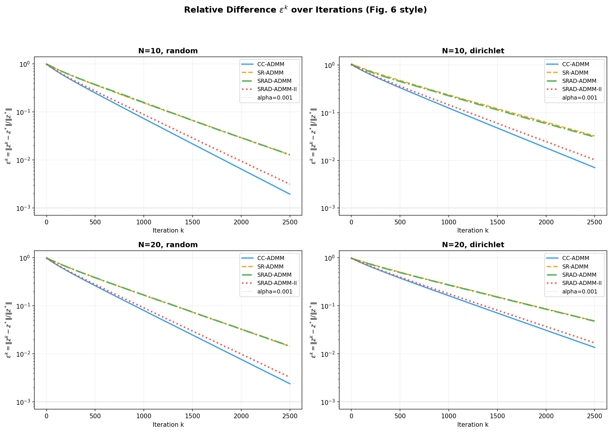
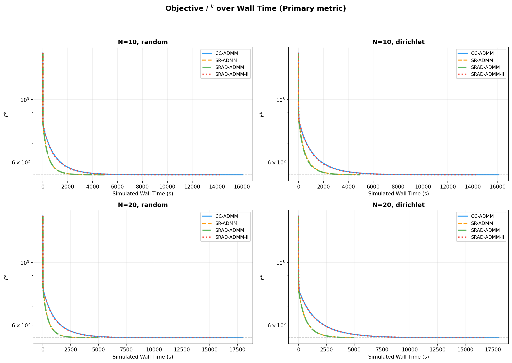
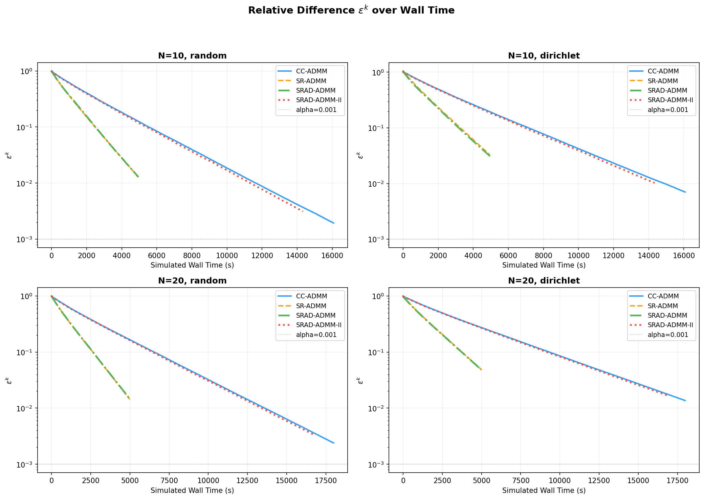

# SRAD-ADMM: Straggler-Resilient Asynchronous Distributed ADMM

This repository provides a Python implementation for simulating and comparing various **Distributed ADMM (Alternating Direction Method of Multipliers)** algorithms, with a focus on **straggler resilience** in heterogeneous computing environments.

**Reference:**  
> J. He, M. Xiao, M. Skoglund, H. V. Poor, "Straggler-Resilient Asynchronous ADMM for Distributed Consensus Optimization," *IEEE Transactions on Signal Processing*, 2025.

---

## 📂 Repository Structure

```
SRAD-ADMM/
├── README.md               # This file
├── requirements.txt        # Python dependencies
├── .gitignore              # Git ignore rules
├── docs/                   # Documentation folder
└── src/                    # Source code
    ├── common.py           # Shared utilities and data generation
    ├── cc_admm.py          # Classical Centralized ADMM (Eq. 2)
    ├── sr_admm.py          # Straggler-Resilient ADMM (Eq. 15, Alg 1-2)
    ├── srad_admm.py        # Asynchronous Decentralized ADMM (Eq. 32, Alg 3-4)
    ├── srad_admm_ii.py     # SRAD-ADMM-II with dynamic δ (Alg 5)
    ├── run_all.py          # Main experiment runner
    ├── srad_admm_simulation_final.py  # Single-file standalone version
    └── results/            # Output plots
        ├── fig_objective.png
        ├── fig_convergence.png
        ├── fig_walltime.png
        └── fig_eps_walltime.png
```

---

## 🧪 Implemented Algorithms

| Algorithm | Type | Description | Wall Time |
|-----------|------|-------------|-----------|
| **CC-ADMM** | Synchronous | All N nodes compute every iteration (Eq. 2) | max(t_i) |
| **SR-ADMM** | Semi-Sync | Waits for Nmin fastest; fast group participates (Eq. 15) | Fast group deadline |
| **SRAD-ADMM** | Asynchronous | Incremental z-update as nodes finish (Eq. 32) | Fast group deadline |
| **SRAD-ADMM-II** | Adaptive Async | Dynamic termination with inter-iteration δ (Alg 5) | Fast group deadline |

### Code Details

#### `common.py`
Core utilities shared across all algorithms:
- **`generate_data()`**: Creates Abalone-like synthetic data (4177 samples, 7 features)
- **`split_random()` / `split_dirichlet()`**: Data distribution to N nodes (IID/Non-IID)
- **`compute_rho()`**: Penalty parameter ρ = 2·max{L_i} + 2 (Proposition V.5)
- **`get_participating_nodes()`**: Determines participating nodes with straggler cutoff (t < 2.0) and message dropout

#### `cc_admm.py` — Classical ADMM (Eq. 2)
```
x_i^k = (A_i^T A_i + ρI)^{-1}(A_i^T b_i - y_i^{k-1} + ρ z^{k-1})
y_i^k = y_i^{k-1} + ρ(x_i^k - z^{k-1})
z^k   = (1/N) Σ_i (x_i^k + y_i^k / ρ)
```
- Fully synchronous: waits for **all** N nodes
- Wall time = max(t_i^k) — bottleneck is the slowest node

#### `sr_admm.py` — Straggler-Resilient ADMM (Eq. 15, Alg 1-2)
- Server waits for Nmin nodes, but all fast nodes (t < 2.0) participate
- Stale contributions from stragglers reused via z = (1/|N^{1:k}|) Σ s_i
- New nodes: y_i = ρ(x_i - x_i^0) — Eq. (10)

#### `srad_admm.py` — Asynchronous Decentralized (Eq. 32, Alg 3-4)
- **Incremental z-update** as each node finishes:
  - Returning node: z = z + (1/N_j)(s_i^new - s_i^old)
  - New node: z = (1/N_j)((N_j-1)·z + s_i)
- Conflict resolution: lower ID has priority (Rule 1, Eq. 34)
- Decentralized: no central server required

#### `srad_admm_ii.py` — SRAD-ADMM-II (Alg 5)
- Dynamic termination with **inter-iteration gap δ**:
  - Condition 1: |N^k| ≥ Nmin → proceed
  - Condition 2: |N^k| ≥ Nmin* AND elapsed ≥ δ → proceed
- δ = time gap between last two iteration completions (Section IV-D)

#### `run_all.py` — Experiment Runner
- Runs all 4 algorithms with K=2500 iterations
- Tests 4 configurations: N={10,20} × {random, dirichlet} distribution
- Generates comparison plots with message dropout (drop_prob=0.01)

---

## 🔄 Changes from Previous Version

| Feature | Previous | Current |
|---------|----------|---------|
| **Participating Nodes** | Nmin only (exactly 2) | Nmin is minimum wait; fast group all participate (~7) |
| **Random Constants** | * 0.7 overlap, * 1.3 window | All removed |
| **Message Dropout** | None | `drop_prob=0.01` (Paper Fig 4-5) |
| **SRAD-ADMM-II δ** | Intra-iteration gap | Inter-iteration gap (Section IV-D) |
| **Wall Time** | CC: max, Others: Nmin-th | CC: max, Others: fast group deadline |

---

## 🚀 How to Run

### 1. Install Dependencies
```bash
pip install -r requirements.txt
```

### 2. Run the Simulation
```bash
cd src
python run_all.py
```

### 3. Check Results
Output plots will be saved to `src/results/`:
- `fig_objective.png` — Objective F^k vs Iterations
- `fig_convergence.png` — Relative error ε^k vs Iterations
- `fig_walltime.png` — Objective F^k vs Wall Time
- `fig_eps_walltime.png` — Relative error ε^k vs Wall Time

---

## 📊 Results

### Objective Function vs. Iteration
Shows how the objective value F^k decreases with iterations.


---

### Convergence vs. Iteration
Relative error ε^k = ||z^k - z*|| / ||z*|| over iterations.



---

### Objective Function vs. Wall Time (Primary Metric)
This is the critical comparison — performance against actual elapsed time.



- **CC-ADMM**: Step-like plateaus as system waits for slowest node
- **SRAD-ADMM**: Continuous updates from faster nodes → steeper drop

---

### Convergence vs. Wall Time
Relative error reduction over real time.



**Key Finding**: SRAD-ADMM achieves target accuracy much faster than synchronous CC-ADMM by eliminating the synchronization barrier.

---

## 📜 License

This project is for research purposes. Please cite the original paper if you use this code.
